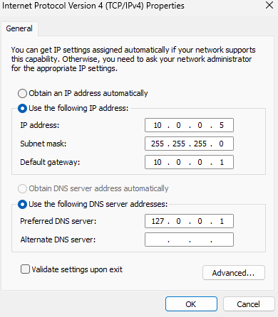
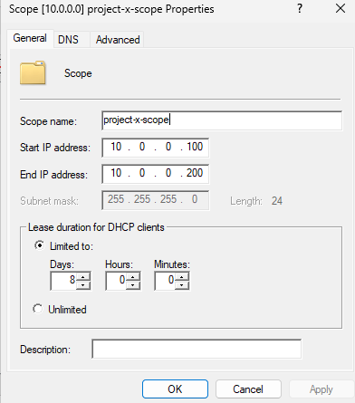
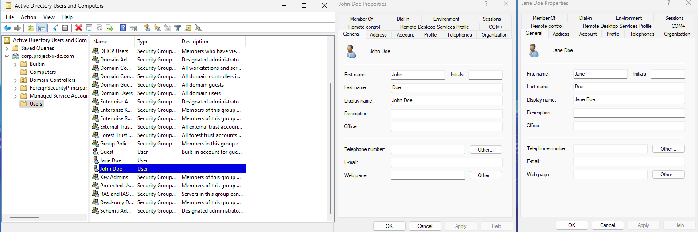

# DC Setup — Active Directory, DHCP, DNS

**Date:** August 19, 2026

## Goal

Skimming through the overall goals of this lab, I began with setting up Active Directory on the Windows 11 domain controller via VirtualBox. This, being my first experience with AD, I simply wanted to add 2 users. 

## What I did

1. Downloaded a Windows Server 2025.iso and added it into VirtualBox
2. Ran setup like normal, inserted Guest Addition CD before getting started
3. Set a static IP (config below)
4. Configured server with the following server roles
    - Active Directory Domain Services
    - DNS Server
    - DHCP Server
5. Promoted the server to a Domain Controller with an appropriate domain name
6. After a long restart, went to DNS manager and added Google's DNS (8.8.8.8) as a forwarding server to enable internet access on the machine
7. Created a new scope under DHCP and deployed (config below)
8. In Server Manager, under Tools -> Active Directory Users and Computers, added two users and their passwords: John Doe (johnd) & Jane Doe (janed)

## Screenshots

## Problems I ran into
Generally didn't run into many problems so far. Everything is very preliminary so far, so I figured it would be a simple setup. However, I definitely had long wait times and issues with VirtualBox. There would be steps where I had to restart my VM only to be met with an infinite loading screen. The only way I could get past this is if I restarted the VM itself, and then it'd finally work. Other than that, went fine.

## What I learned
Learned a lot about what subnet masks and gateways are while I was setting up the static IP and DHCP. 
I had always heard these terms but I did some digging with Claude to actually learn what it meant. Initially interpreting subnet masks as a garble of numbers, I learned that 255 is actually just the decimal notation for a byte of all 1s. This would mean 255.255.255.0 is 24 bits set to 1, hence the /24 CIDR notation. The last octet would determine the host, and everything before determines the actual network. 
Also found DHCP super cool. I had already known that its purpose is to provide IP addresses to devices on a network, but I didn't think it'd be by setting a range of IP addresses. The term 'gateway' also made a ton of sense here. It was initially set to 10.0.0.1 in the static IP config, and that same gateway is used for setting up DHCP because that's how users will connect to the internet. It clicked in my head that 10.0.0.1 is basically the routers IP address.
While this is was a pretty simple and straightforward setup, I think it connected a lot of the dots in my head about networking terms I always hear but never truly understood.

## Next steps
With AD set up, I'm excited to now connect Windows and Linux workstations as users in the AD server. This opens tons of opportunities to tinker and expand this corporate server.  