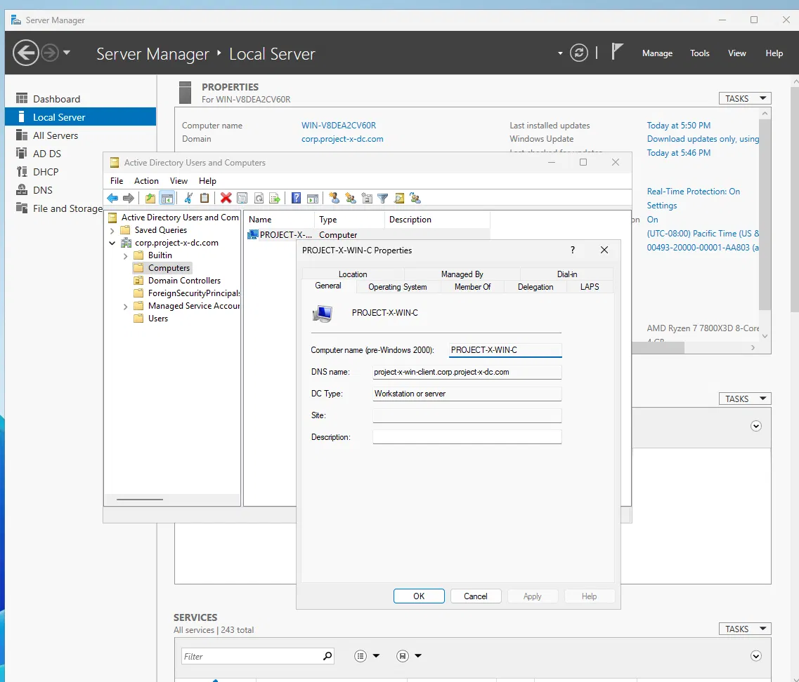
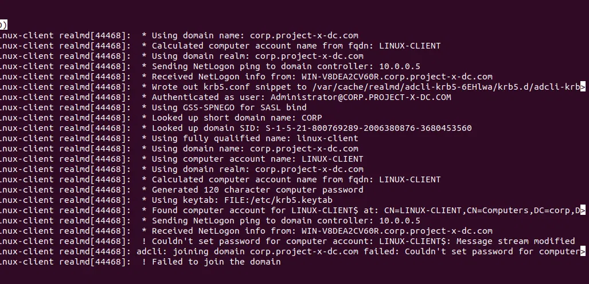
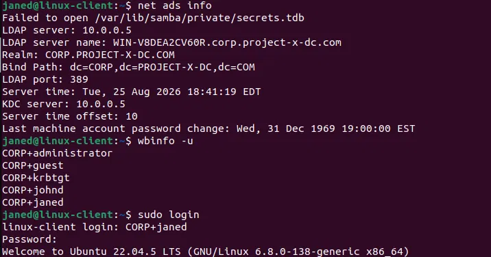
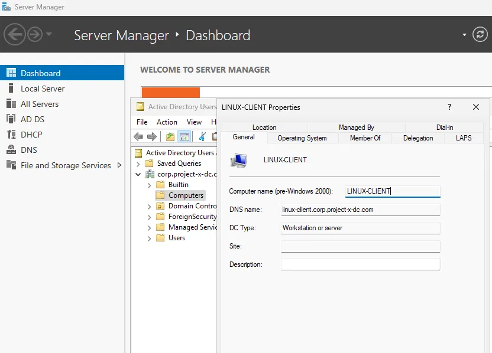

# Workstation Setup — Joining Windows 11 & Ubuntu Machines to Domain Controller

**Date:** August 24, 2026

## Goal

With the DC working, the next step was getting both workstations 
(Windows 11 and Ubuntu Desktop) actually joined to the domain so johnd 
and janed could log in as real domain users.

## What I did

### Windows 11 Client

1. Provisioned the Windows 11 Enterprise VM
2. Set the client's DNS to point to the DC (10.0.0.5)
3. Went to System Properties → Change domain, entered corp.project-x-dc.com
4. Hit an error immediately. The join couldn't reach the DC's DNS
5. Traced it to the VM's network adapter being set to Host-Only (I'd set 
   this earlier to skip the Windows login screen during setup)
6. Switched the adapter to the NAT Network, retried the join, entered 
   Administrator credentials, and it went through
7. Confirmed in ADUC on the DC. PROJECT-X-WIN-C showed up in the 
   Computers container with the correct DNS name
8. Logged in as johnd on the client, ran `whoami` in Command Prompt, 
   returned `corp\johnd`, confirming a real domain login

### Ubuntu Desktop Client — attempt 1: realmd/SSSD

1. Confirmed DNS should point to the DC, ran `resolvectl status` and it showed 
   10.0.2.3, VirtualBox's default NAT address, not my lab network at all
2. Fixed the adapter (same Host-Only/NAT issue as the Windows client), 
   but then hit an issue again, this time the adapter was on Bridged mode, 
   pulling my actual home router's DNS. Son😭
3. Fixed it properly this time: NAT Network + manually set DNS to 10.0.0.5
4. Tried installing the realmd/sssd/adcli packages. apt hung indefinitely 
   at 0%, never reaching Ubuntu's mirrors
5. Assumed it might be a tool-specific issue and tried the Samba/winbind 
   packages instead, but same hang. This told me it wasn't realmd specific, 
   but something else that's scarier, worse, terrifying. 
6. Spent a while debugging connectivity: `ping 10.0.0.5` returned 
   "Destination Host Unreachable," `nslookup` timed out, NetworkManager's 
   IPv4 config looked completely correct (right IP, gateway, DNS), and 
   the VirtualBox NAT Network's CIDR was confirmed correctly set to 
   10.0.0.0/24
7. Eventually checked the obvious thing I hadn't: whether the DC VM was 
   even running😭😭. It wasn't :( Powered it back on and connectivity was 
   immediately fine. Had to take a deep breath after this.
8. With the DC actually reachable, retried the realmd/sssd join. I got 
   through DNS, NetLogon, and Kerberos authentication as Administrator 
   successfully, but it failed on the very last step, setting the new 
   computer account's password, with the error `Message stream modified`
9. Looked online about this. Turned out to be a known, currently open 
   compatibility issue between adcli and Windows Server 2025 specifically, 
   not something I misconfigured. Confirmed by matching reports from 
   other people hitting the identical error against Server 2025

### Ubuntu Desktop Client — attempt 2: Samba/winbind

1. Installed winbind, libpam-winbind, libnss-winbind, and related packages
2. Configured Samba to join the domain by editing `/etc/samba/smb.conf` and
    `/etc/resolv.conf` to the appropriate domain names and DNS configs
3. Ran `net ads info` to confirm. Showed the LDAP server, realm, and KDC 
   all resolving correctly against the DC
4. Ran `wbinfo -u`, successfully listed domain users (administrator, 
   guest, krbtgt, johnd, janed), confirming winbind could query AD live
5. Logged in as CORP+janed, ran `id`, showed a proper UID/GID mapping 
   (uid=2001104, gid=2000513 for Domain Users), confirming the account 
   is fully functional, not just authenticated
6. Confirmed on the AD side, LINUX-CLIENT shows up in ADUC with the 
   correct DNS name

## Screenshots

## Problems I ran into

The Windows side was mostly smooth. Only had one issue being the adapter setting in VirtualBox. Other than that, very straightforward

The Ubuntu side was a much longer, annoying process. My issues in order: 
two separate adapter misconfigurations (Host-Only, then Bridged) before DNS was even correct, then a very silly mistake where I assumed the DC itself was unreachable when in reality it just wasn't powered on (facepalm), and finally a genuine upstream bug in adcli/SSSD against Windows Server 2025 that had nothing to do with anything I'd configured. Every step of debugging along the way (checking 
NetworkManager directly, checking the NAT Network's CIDR, checking ping 
vs nslookup vs realm discover) turned out to be correctly reasoned, even 
though most of them weren't the actual cause. I still think this is useful
to write down, even if I got literally nothing done in my first attempt, but
I believe its very valuable to understand why something went wrong. 

## What I learned

The biggest thing I learned was that SSSD and Samba/winbind solves the same problem (letting Linux authenticate against AD) but does it completely differently when looking deeper into it. Both have to do the same last step, which is to set a password on a newly created AD computer account, but they use different code to do it. Samba's `net ads join` has its own independent implementation, so it didn't hit the same Server 2025 bug that adcli did.

I also genuinely understand what winbind is actually doing when a user 
logs in. AD identifies users by SID, but Linux has no concept of SIDs,
everything on Linux runs on UID/GID numbers. Winbind's job is maintaining 
a live mapping between AD SIDs and Linux UID/GIDs, which is why `id` 
showed janed with a real numeric UID instead of just failing or treating 
her as unknown.

Also learned the very silly lesson that a DC that's not running can 
produce symptoms that look exactly like a dozen different network 
issues, and it's worth checking early rather than last.

## Next steps

With both workstations joined and verified, I have 
to now set up a Corporate Server and MailHog setup.